# Memegenerator
--------------

 Cool Application for creating memes with Top and Bottom Text
 
 
 Screen-Shots
--------------
- Search for any image
 <table>
    <tr>
     <td>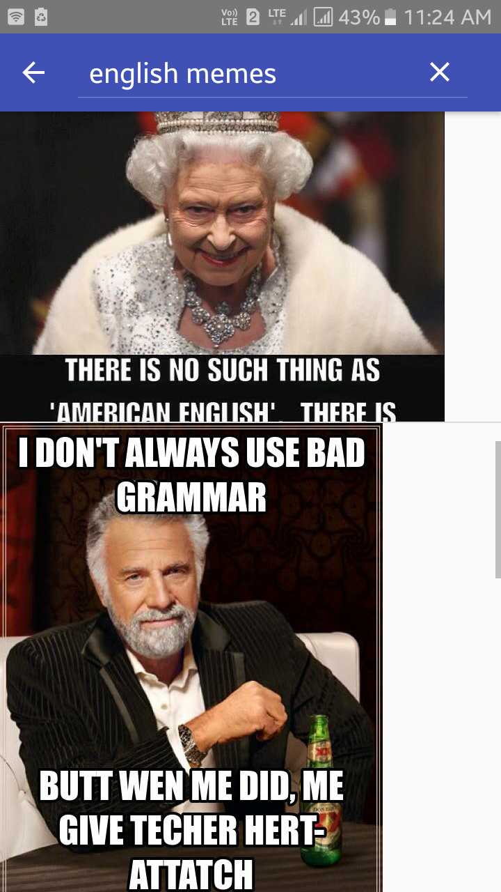</td>
     <td>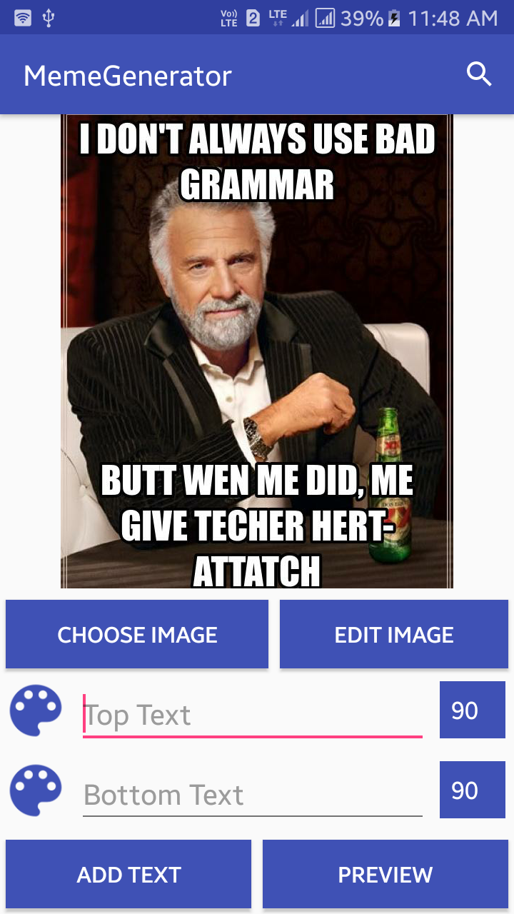</td>
    </tr>
  </table>

- Choose any image from gallery

- Add bottom and top text (You can even customize it by selecting font color and font size)
<table>
    <tr>
     <td>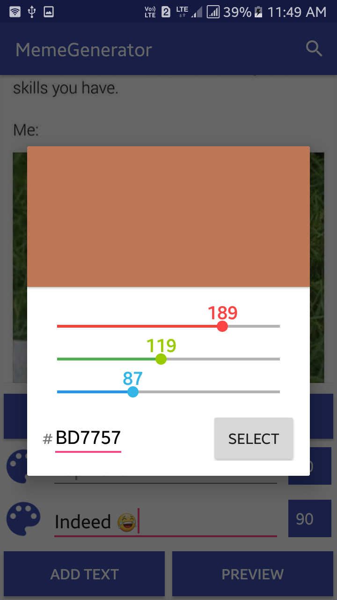</td>
     <td>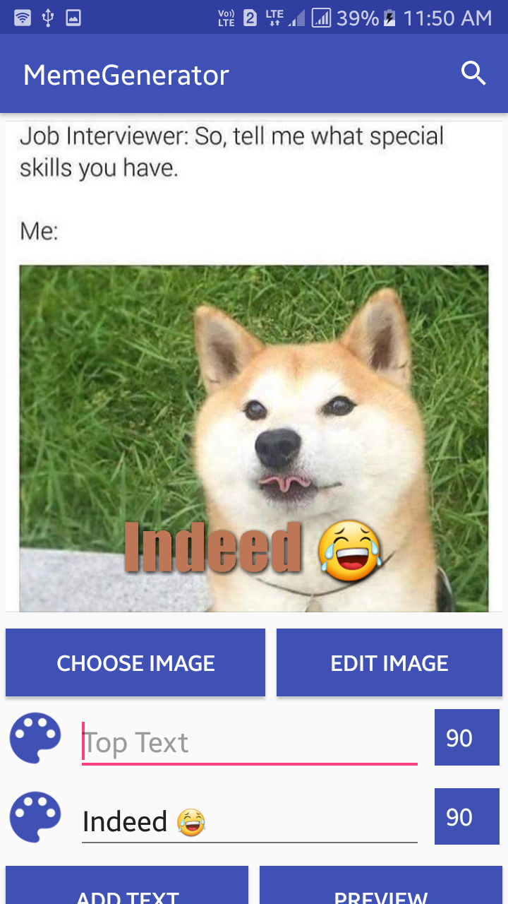</td>
    </tr>
  </table>
  
- Edit the image selected 
<table>
    <tr>
     <td>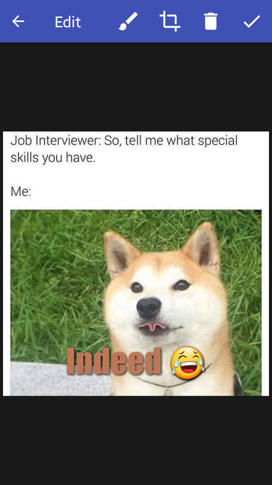</td>
     <td>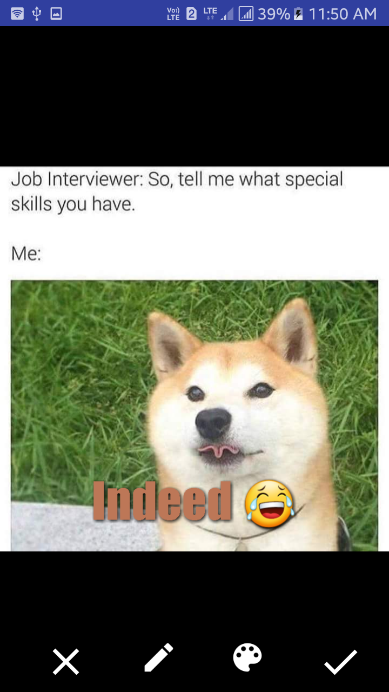</td>
     <td>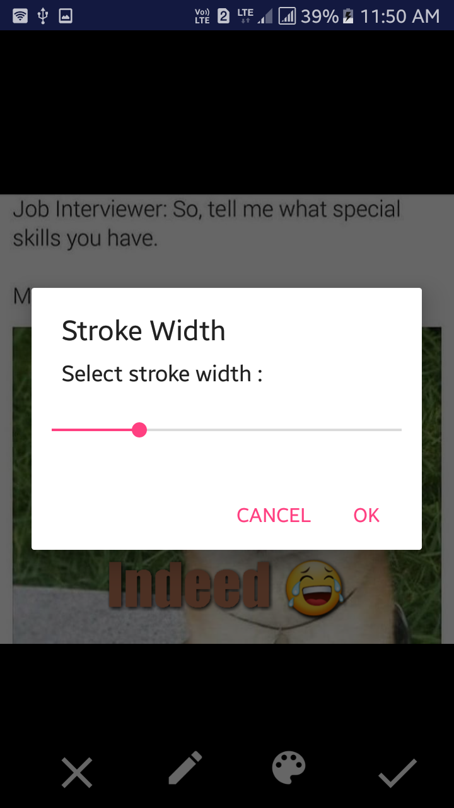</td>
    </tr>
    <tr>

     <td>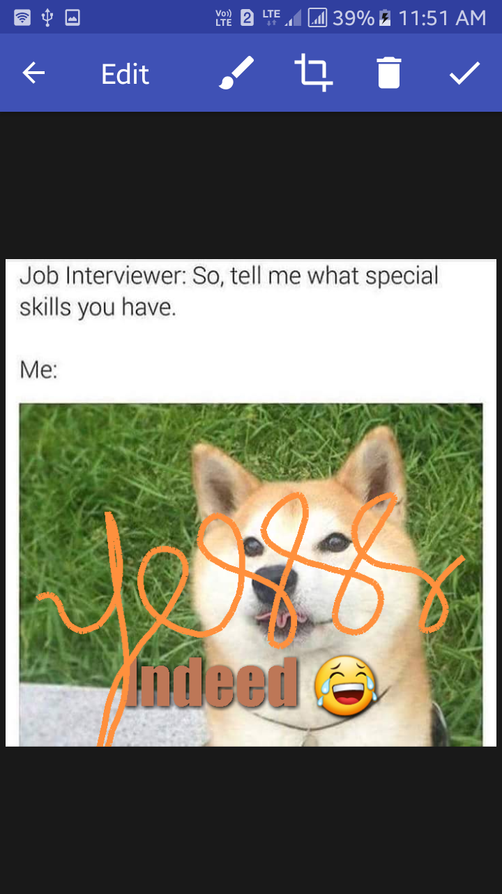</td>
     <td>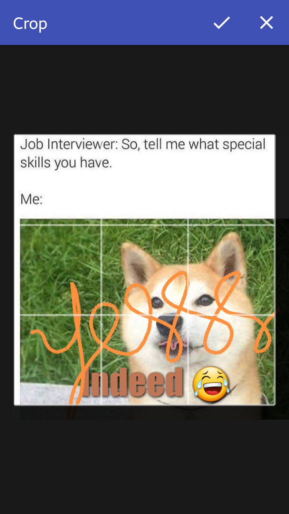</td>
     <td>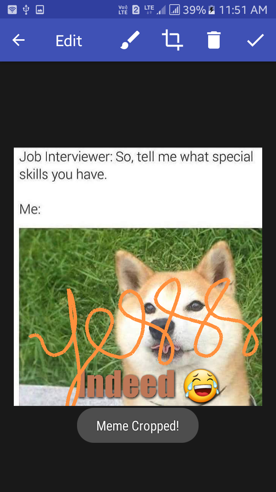</td>
    </tr>
 </table>
  
 - Preview of the final meme   
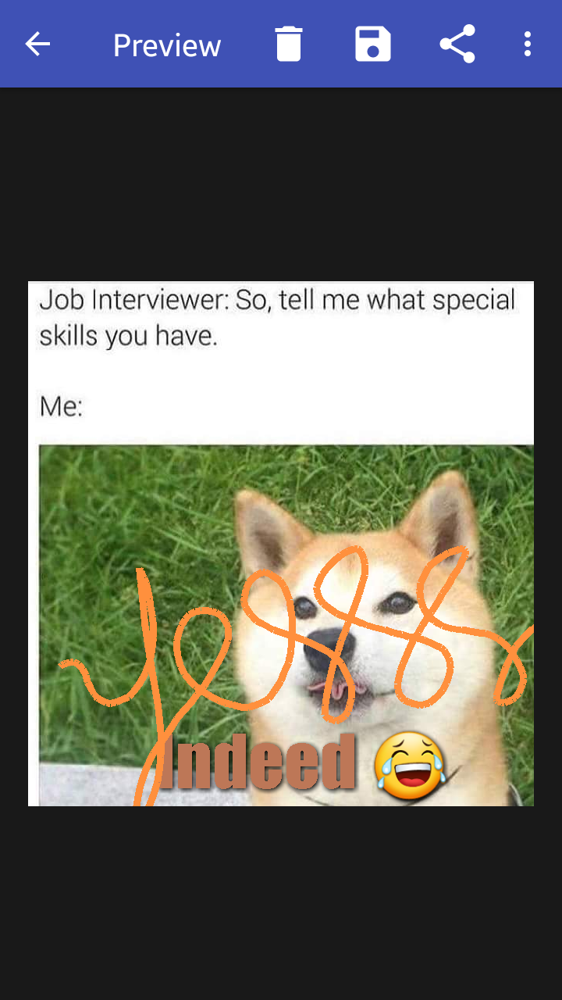

- Share the meme
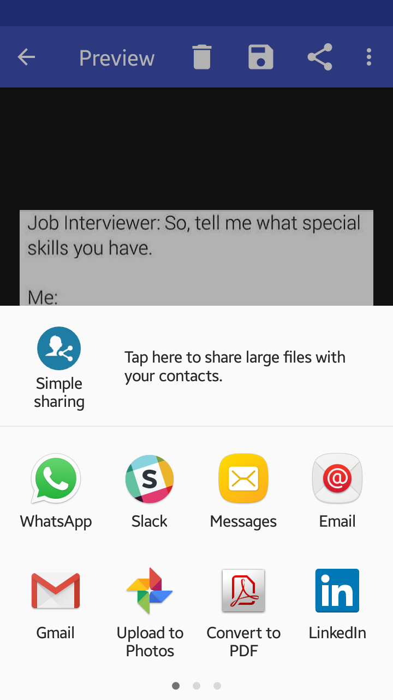

- Don't worry if you accidently click on delete or back button. :)

